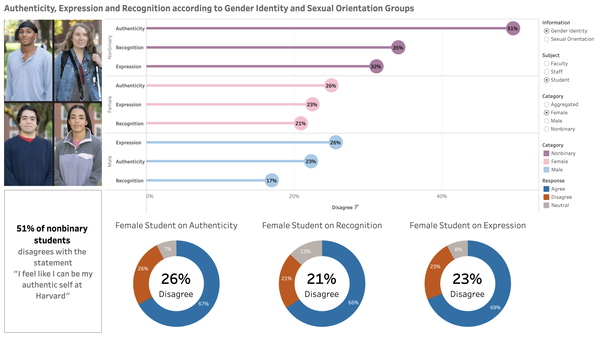

# Portfolio
---
# [Google Fiber Business Intelligence Project](https://public.tableau.com/views/GoogleFiberDashboard_16873889664000/Presentation?:language=en-US&:display_count=n&:origin=viz_share_link)
> This project was part of the [Google Business Intelligence Specialization](https://www.coursera.org/account/accomplishments/specialization/certificate/7W8QFGV99NC7) with Coursera, specifically utilizing Big Query to exract data and Tableau for visualization. This end-of-course project was designed to apply skills in a workplace scenario from project planning to execution.

- Project goal is to explore trends in repeat callers, providing insights into call volume, types of customer issues, and trends across different market cities. This is to eventually plan how to reduce call volume, increase customer satisfaction, and improve operational optimization, with stakeholders having access to all datasets and accessible dashboards. Here is a link to the [documentation](https://drive.google.com/drive/folders/1GUjI2xpQ4PStALbQzIjD8kc5O2MRo3qh?usp=sharing).
- Some insights from the analysis showed that first calls were mostly for Tech Troubleshooting and Internet and Wifi issues. However, across majority of the markets, repeat calls were for Internet and Wifi issues, which presents an opportunity for improvement for Google Fiber.

---

# [Harvard Diversity Inclusion and Belonging Analysis](https://public.tableau.com/views/A2Presentation-Final/Presentation?:language=en-US&:display_count=n&:origin=viz_share_link)
> This was a team project as part of the MBAN program at Hult, specifically utilizing Tableau for data visualization. As such, due credit goes to my teammates as well: Daniel Evenschor, Hafez Bajammal, Pablo Guala, Polina Afanasyeva, Priscilla Chacur. 

- The Harvard Diversity Inclusion and Belonging Analysis project aims to analyze data collected from staff, students, and faculty at Harvard University. By visualizing and highlighting these insights, the project aims to raise awareness and foster initiatives to enhance diversity, inclusion, and belonging.
- The analysis reveals significant findings, including the observation that individuals identifying as Nonbinary or Bisexual feel a lack of belonging within the university. This sense of not belonging may have implications for their authenticity and overall well-being within the academic environment.

- Additionally, the findings suggest that these groups may perceive a lack of safety within the university, impacting their sense of security and comfort.

---

# [Analytics Report on Expansion for European Sports Brand](https://github.com/audreyanne96/Hult-MBAN-Projects/tree/main/Python/Expansion%20Analysis%20for%20European%20Sports%20Brand)
> This was an individual project as part of the MBAN program at Hult, specifically utilizing Python for data analytics and visualizations. 

- A European sports clothes company is embarking on a market expansion strategy to reach beyond its current markets in Europe and Central Asia. The company aims to identify potential regions and markets for its products and determine the most effective product types to establish brand recognition in those areas.
- To make informed decisions about market expansion, an extensive analysis was conducted using data from the World Bank. Key factors considered included *Leisure Time*, *Market Size*, and *Market Stability*.
- The analysis identified North America and the Middle East & North Africa as the most promising regions for market entry. Specifically, the United States and Canada in North America, and the United Arab Emirates (UAE) in the Middle East & North Africa, were recommended as ideal starting points.

- For the North American market, *California* emerged as the state with the highest level of activity and market potential. In this region, the most in-demand products were found to be sports apparel, fan apparel for various sports teams, and golf apparel for women. To effectively penetrate the market, the company should position its prices in alignment with its competitors.

- In the Middle East & North Africa market, it is crucial for the company to establish strong relationships with existing platforms such as *noon* and *Namshi*. A notable gap in the market was identified for cotton/cotton blend sports and leisure apparel for women. To capitalize on this opportunity, the company should focus on filling this gap while maintaining competitive pricing strategies

---

# [Analytics Report on Analyzing Customer Churn](https://github.com/audreyanne96/Hult-MBAN-Projects/tree/main/Python/Analyzing%20Customer%20Churn)
> This was a team project as part of the MBAN program at Hult, specifically utilizing Python and machine learning to predict customer churn. As such, due credit goes to my teammates as well: Pablo Guala, Maria Turbi, Artyom Blazko, Ayowole Delegab, and Cedric Sollie.

- The Marketing Department is undertaking a comprehensive analysis to identify the key factors influencing customer retention, including personal characteristics, subscription type, and services offered. The primary objective is to develop a predictive model that can accurately forecast customer churn, enabling targeted customer engagement and the formulation of effective strategies to achieve the optimal product-market fit.
- The ability to predict customer churn is crucial for managing engagement terms and costs, as well as improving overall customer satisfaction and loyalty.
- In pursuit of this goal, the project explored various predictive models, including Logistic Regression, Decision Tree, and Random Forest. After rigorous testing and tuning, the Random Forest Classification model exhibited exceptional performance, achieving a remarkable F1-score of 0.90, an AUC of 0.9271, and 94% accuracy in predicting churn.

  

- Further analysis revealed the top customer characteristics that had the most significant impact on churn.

- Based on these findings, the team recommends implementing targeted strategies to address customer churn. This includes focusing on customers with short tenure by offering incentives for longer contract lengths, bundling multiple services to enhance value, providing additional benefits to customers with lower credit scores, and fostering loyalty among mid-high income customers.
- By implementing these recommended actions, the Marketing Department aims to reduce churn rates, enhance customer satisfaction, and optimize business performance. The insights gained from this analysis will guide data-driven decision-making, fostering stronger customer relationships and driving sustainable growth in the organization.

---

# [Gathering Consumer Insights for BBY](https://github.com/audreyanne96/Hult-MBAN-Projects/tree/main/R%20Programming/Consumer%20Insights%20for%20BBY)
> This was an individual project as part of the MBAN program at Hult, specifically utilizing R Programming for data analytics and visualizations.

- Senior management has initiated an extensive exploratory analysis of the customer base of Bedding, Bathing and Yonder (BBY) with the objective of identifying micro-segments and personas for their loyalty program. The aim is to gain a deeper understanding of their customers and tailor offerings and experiences to enhance customer satisfaction and loyalty.
- To capture a higher-end market segment, the project suggests implementing a strategic pricing approach that caters to the upper middle-class market. This will involve creating an elevated and luxurious in-store experience while maintaining convenience for customers.

- Recognizing the importance of catering to diverse customer needs, the analysis highlights the significance of targeting senior citizens. Efforts should be made to ensure that products and marketing strategies are designed with their preferences in mind. Additionally, physical stores should incorporate accessibility features to accommodate the needs of the elderly.

- To effectively engage with the target market, the project proposes generating content centered around their interests, with a particular emphasis on Health & Fitness. This content should be tailored for educated individuals, both employed and retired, aligning with their aspirations and lifestyle choices.
- Furthermore, it is crucial to ensure that online content is easily accessible and not confined to niche areas of the internet. This will enable broader reach and engagement with the target audience, ensuring that they can easily discover and interact with BBY's offerings.
- By implementing these recommendations, BBY aims to establish a strong connection with their customers, enhance customer satisfaction, and cultivate loyalty. The insights obtained from this analysis will guide strategic decision-making, driving the company's growth and positioning them as a leading provider of luxurious and convenient products and experiences in the market.
